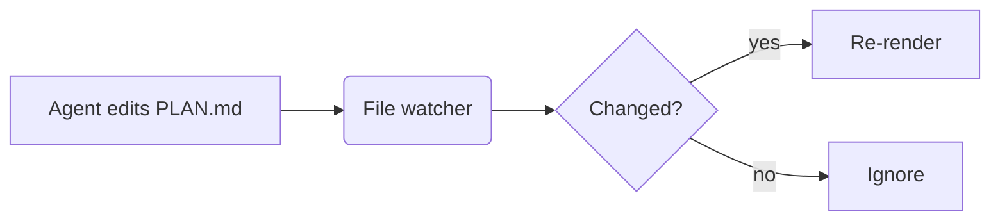

# MD Viewer Showcase

A native macOS reader for Markdown. This document exercises the **supported syntax**, so it
doubles as a visual test. Text can be *emphasised*, **strong**, ***both***, ~~struck through~~,
or `inline code`. Bare URLs like https://github.com are linked automatically, and so are
[regular links](https://www.apple.com) and [relative links](./Linked.md#details).

## Lists

1. Open files with **⌘O** or drop them on the window
2. Switch tabs with **⇧⌘[** and **⇧⌘]**
   - Nested bullet
     - Deeper bullet with `code`
   - Another nested item
3. Close the app — the session comes back

- [x] Session restoration
- [x] Live reload when an agent edits the file
- [ ] Something still to do

## Code

```swift
@MainActor
final class DocumentManager {
    private let watchDebounce: DispatchTimeInterval = .milliseconds(150)

    func reload(_ session: DocumentSession) async {
        let text = try? String(contentsOf: session.fileURL, encoding: .utf8) // read
        print("Loaded \(text?.count ?? 0) characters")
    }
}
```

```bash
# Build and run the tests
xcodebuild -project MDViewer.xcodeproj -scheme MDViewer test | xcpretty --color --report junit --output build/reports/junit.xml
```

```json
{ "name": "simple-md-viewer", "version": 1, "restoresSession": true }
```

```diff
- let parser = HandWrittenParser()
+ let document = Document(parsing: source)
```

## Quotes and Alerts

> Markdown is intended to be as easy-to-read and easy-to-write as is feasible.
>
> — John Gruber

> [!NOTE]
> Relative images and links resolve against the document's folder.

> [!WARNING]
> Unsaved edits are never overwritten by changes on disk.

## Table

| Feature            | Status | Shortcut |
|:-------------------|:------:|---------:|
| Open file          |   ✅   |       ⌘O |
| Find in document   |   ✅   |       ⌘F |
| Close tab          |   ✅   |       ⌘W |
| Edit source        |   ✅   |      ⇧⌘E |

---

## Images


A missing image shows a placeholder: 

## HTML

Press <kbd>⌘</kbd> <kbd>⇧</kbd> <kbd>T</kbd> to reopen a tab. Water is H<sub>2</sub>O,
area is r<sup>2</sup>, and <mark>highlighted</mark> or <u>underlined</u> text works too.

<p align="center">
  <br>
  <b>Centered with HTML</b>
</p>

<details>
<summary>Click to expand details</summary>

Collapsed content with **Markdown** inside.

</details>

## Footnotes and Math

Footnotes are numbered by first reference[^first], and can be long[^long].
Inline math like $e^{i\pi} + 1 = 0$ sits on the baseline, while $5 and $10 stay text.

$$
\int_0^1 x^2\,dx = \frac{1}{3}
$$

## Diagram



### Heading Level 3

#### Heading Level 4

##### Heading Level 5

###### Heading Level 6

The end.

[^first]: The first footnote.
[^long]: A footnote with `code` and a [link](https://example.com).
